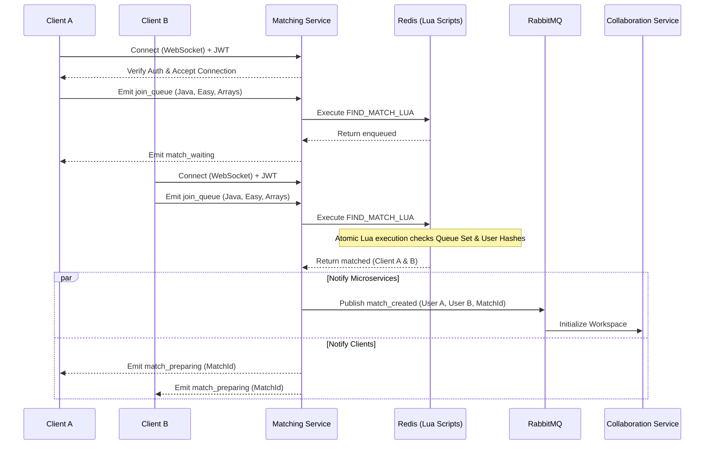

[](https://classroom.github.com/a/HpD0QZBI)
# CS3219 Project (PeerPrep) - AY2526S2
## Group: G02

### Note: 
- You are required to develop individual microservices within separate folders within this repository.
- The teaching team should be given access to the repositories, as we may require viewing the history of the repository in case of any disputes or disagreements. 

PeerPrep is a real-time collaborative platform designed to help students ace their technical interviews. By matching users based on their proficiency, preferred programming language, and topic, PeerPrep provides an isolated, synchronized workspace to solve algorithmic challenges together.

---

## 🏗 System Architecture

*(Insert your high-level system architecture diagram here)*

## 🚀 Quick Start (Local Development)

### Prerequisites
- Docker and Docker Compose
- Node.js (v18+)
- Local `.env` file (See `env.example` in the root directory)

### Running the System

```bash
# Clone the repository
git clone https://github.com/your-org/peerprep.git
cd peerprep

# Build and spin up all microservices, databases, and message brokers
docker-compose up --build
```

> **Note:** Database seeding runs automatically on startup. Check the runbook in the additional files for troubleshooting.

---

## 🧩 Microservices Documentation

### 1. User Service
(To be completed by team members)

### 2. Matching Service

The Matching Service pairs users in real-time based on selected topics, difficulties, and programming languages. It leverages WebSockets for real-time bidirectional communication and Redis as an in-memory data store to handle concurrent matching queues safely and efficiently.

#### ⚙️ Tech Stack
- Runtime: Node.js / TypeScript  
- Communication: Socket.io (WebSockets)  
- State Management & Concurrency: Redis (with embedded Lua scripting)  
- Inter-service Messaging: RabbitMQ  

#### 🗄️ Redis Data Models (Schemas)

To ensure horizontal scalability, all matchmaking states are centralized in Redis rather than local server memory.

**Queue Sorted Sets (`mm:q:{topic}:{difficulty}:{language}`)**
- Type: Sorted Set (ZSET)
- Score: Entry timestamp (milliseconds), enforcing FIFO
- Member: Seeker’s Redis key (`mm:us:{userId}`)

**Seeker Hash (`mm:us:{userId}`)**
- Type: Hash (HSET)
- Fields:
  - `status`: READY, DISCONNECTED, MATCHED
  - `last_seen`: Timestamp of last socket heartbeat
  - `start_time`: Initial queue entry time
  - `queues`: JSON array of active queues
  - `score`: User proficiency score
  - `config`: JSON string of user search parameters

---

## 🔄 Inter-Service Flows & Integrations

### 1. Authentication (via User Service / API Gateway)

Before a WebSocket connection is established, the handshake passes through authentication middleware. JWT session tokens are verified via the API Gateway or User Service. Invalid tokens terminate the connection.

### 2. Handoff to Collaboration Service (via RabbitMQ)

Once a match is found:
- Matching Service generates a `matchId`
- Publishes `CreateSession` event to RabbitMQ
- Collaboration Service initializes the coding workspace
- Clients receive `match_preparing` event and route to collaboration UI

---

## 📊 Matchmaking Flow Sequence



---

## 🛡️ Design Considerations & Concurrency Control

**Atomicity via Lua Scripts**  
Matchmaking operations are wrapped in Redis Lua scripts to ensure atomic execution and prevent race conditions.

**Horizontal Scalability**  
All state resides in Redis, allowing stateless WebSocket servers across instances.

**Graceful Relaxation**  
Matching constraints are relaxed over time (e.g., widening score range) to improve match rates.

---

## ⚠️ Edge Case Handling

**Multi-Tab Problem**  
Handled via `attemptRejoin` Lua script and shared Redis state.

**Sudden Disconnections**  
Users are marked DISCONNECTED with a grace period (e.g., 5 seconds) for reconnection.

**Phantom Cancels**  
Atomic scripts ensure consistency when cancel and match events happen simultaneously.

---

### 3. Question Service
(To be completed by team members)

### 4. Collaboration Service
(To be completed by team members)

### 5. Attempt Service
(To be completed by team members)

---

## 🧪 CI/CD Pipeline

- Linting & Formatting: ESLint + Prettier  
- Automated Testing: Runs on every PR  
- Coverage: Minimum 80% required  

---

## 👥 Team Members (Group 02)

- Kevin Limantoro (A0276912X)  
- V Varsha (A0286877B)  
- Kenny Lewi (A0281398N)  
- Low Hsin Yi (A0278079L)  